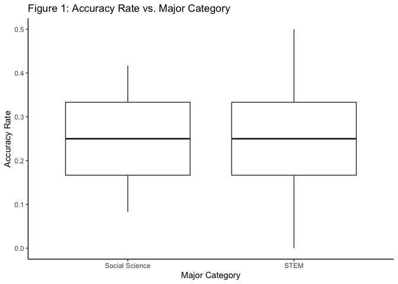
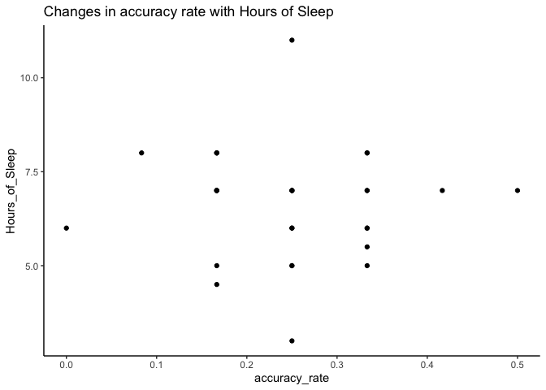
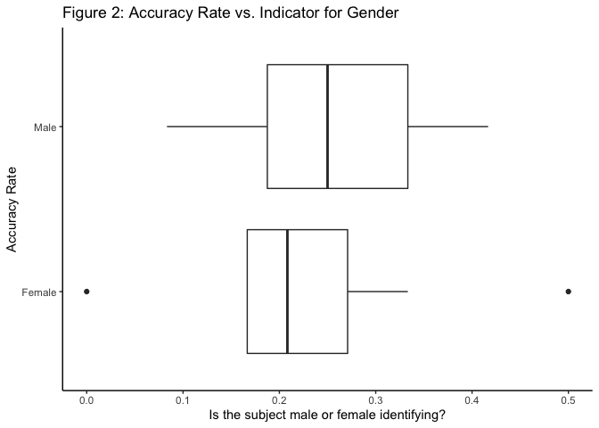
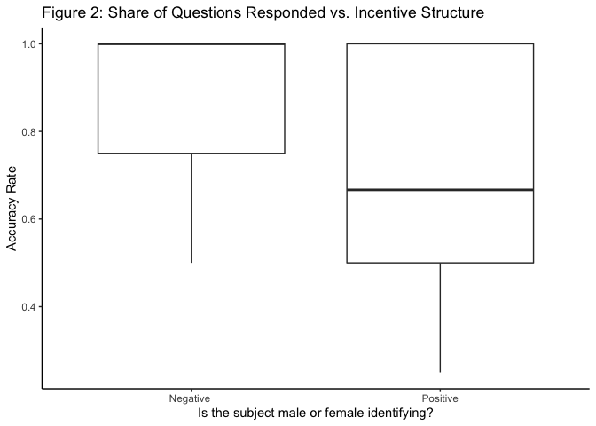
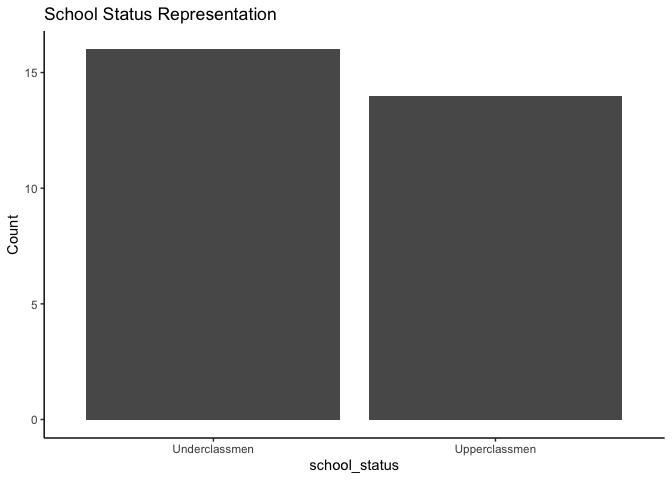
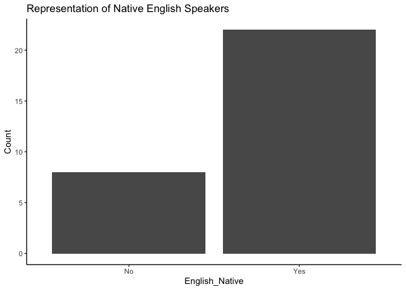
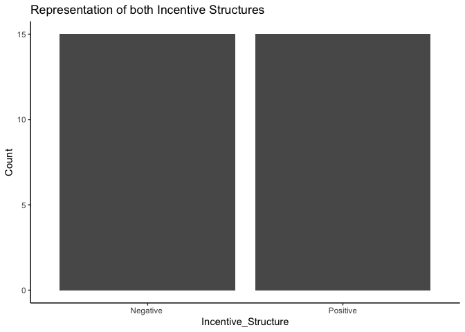
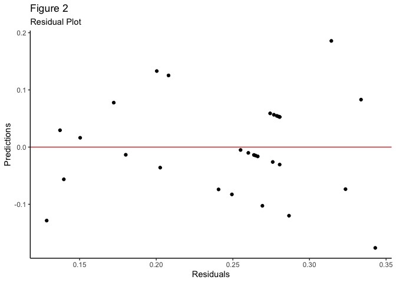

Negative Incentive Framing Structures in Cognitively Demanding Tasks
================
Tshering Wangchuk and Franco Salinas Meza

    ##   Gender == "Female" n
    ## 1              FALSE 8
    ## 2               TRUE 7

<!-- --><!-- --><!-- --><!-- --><!-- --><!-- --><!-- --><!-- --><!-- --><!-- --><!-- --><!-- --><!-- --><!-- --><!-- --><!-- --><!-- --><!-- -->

    ##                           accuracy_rate     Gender Number_of_Classes
    ## accuracy_rate                1.00000000 -0.1478227        0.31016591
    ## Gender                      -0.14782275  1.0000000       -0.33926581
    ## Number_of_Classes            0.31016591 -0.3392658        1.00000000
    ## share_questions_responded    0.40553031 -0.2254090        0.32118893
    ## English_Native               0.17215953 -0.1230915        0.25056441
    ## Incentive_Structure         -0.41779650  0.1360828       -0.16620562
    ## Guess                       -0.06580809 -0.2526234        0.03739919
    ##                           share_questions_responded English_Native
    ## accuracy_rate                             0.4055303      0.1721595
    ## Gender                                   -0.2254090     -0.1230915
    ## Number_of_Classes                         0.3211889      0.2505644
    ## share_questions_responded                 1.0000000      0.4198079
    ## English_Native                            0.4198079      1.0000000
    ## Incentive_Structure                      -0.3240804     -0.1507557
    ## Guess                                     0.2943960      0.2713814
    ##                           Incentive_Structure       Guess
    ## accuracy_rate                      -0.4177965 -0.06580809
    ## Gender                              0.1360828 -0.25262337
    ## Number_of_Classes                  -0.1662056  0.03739919
    ## share_questions_responded          -0.3240804  0.29439601
    ## English_Native                     -0.1507557  0.27138141
    ## Incentive_Structure                 1.0000000 -0.22501758
    ## Guess                              -0.2250176  1.00000000

Insights:

Model 1: Criteria(correlation larger than 0.1 or smaller than -0.1), I
realized that variables with correlation that is lower than 0.3 or
larger than -0.3 didn’t have an important impact on the model.

    Gender 
    Number_of_Classes 
    share_questions_responded 
    English_Native 
    Incentive_Structure  
    Guess

## Understanding Factors that affect accuracy

Notes: English native increased our p value by a lot Gender increased by
a little Number of classes incrased p value by a lot

*E*\[Accuracy Rate\] = *β*0 + *β*1 \* Incentive Structure

*E*\[Accuracy Rate\] = *β*0 + *β*1 \* Incentive Structure + *β*2 \* Gender + *β*3 \* Number of Classes + *β*4 \* Share of Questions Responded + *β*5 \* English Native + *β*6 \* Number of Guesses

    ## 
    ## Call:
    ## lm(formula = accuracy_rate ~ Incentive_Structure + Gender + Number_of_Classes + 
    ##     share_questions_responded + English_Native + Guess, data = data_final)
    ## 
    ## Residuals:
    ##      Min       1Q   Median       3Q      Max 
    ## -0.17628 -0.05125 -0.01177  0.05439  0.18572 
    ## 
    ## Coefficients:
    ##                              Estimate Std. Error t value Pr(>|t|)  
    ## (Intercept)                  0.178446   0.075986   2.348   0.0278 *
    ## Incentive_StructurePositive -0.068484   0.036253  -1.889   0.0716 .
    ## GenderMale                   0.009252   0.038076   0.243   0.8102  
    ## Number_of_Classes            0.014368   0.019043   0.754   0.4582  
    ## share_questions_responded    0.131112   0.087817   1.493   0.1490  
    ## English_NativeYes            0.004527   0.043300   0.105   0.9176  
    ## Guess                       -0.014304   0.010537  -1.358   0.1878  
    ## ---
    ## Signif. codes:  0 '***' 0.001 '**' 0.01 '*' 0.05 '.' 0.1 ' ' 1
    ## 
    ## Residual standard error: 0.09263 on 23 degrees of freedom
    ## Multiple R-squared:  0.3386, Adjusted R-squared:  0.1661 
    ## F-statistic: 1.962 on 6 and 23 DF,  p-value: 0.1132

    ## 
    ## Call:
    ## lm(formula = accuracy_rate ~ Incentive_Structure, data = data_final)
    ## 
    ## Residuals:
    ##      Min       1Q   Median       3Q      Max 
    ## -0.20556 -0.03889 -0.03889  0.04444  0.21111 
    ## 
    ## Coefficients:
    ##                             Estimate Std. Error t value Pr(>|t|)    
    ## (Intercept)                  0.28889    0.02422  11.930 1.71e-12 ***
    ## Incentive_StructurePositive -0.08333    0.03425  -2.433   0.0216 *  
    ## ---
    ## Signif. codes:  0 '***' 0.001 '**' 0.01 '*' 0.05 '.' 0.1 ' ' 1
    ## 
    ## Residual standard error: 0.09379 on 28 degrees of freedom
    ## Multiple R-squared:  0.1746, Adjusted R-squared:  0.1451 
    ## F-statistic: 5.921 on 1 and 28 DF,  p-value: 0.0216

<!-- --><!-- -->

                     Linear regressions of accuracy rates                       
             ─────────────────────────────────────────────────────
                                            (1)          (2)      
                                       ───────────────────────────
               (Intercept)                 0.178 *     0.289 ***  
                                          [0.028]     [0.000]     
               Incentive_StructurePosi    -0.068      -0.083 *    
               tive                                               
                                          [0.072]     [0.022]     
               GenderMale                  0.009                  
                                          [0.810]                 
               Number_of_Classes           0.014                  
                                          [0.458]                 
               share_questions_respond     0.131                  
               ed                                                 
                                          [0.149]                 
               English_NativeYes           0.005                  
                                          [0.918]                 
               Guess                      -0.014                  
                                          [0.188]                 
                                       ───────────────────────────
               N                          30          30          
               R2                          0.339       0.175      
               logLik                     32.791      29.468      
               AIC                       -49.583     -52.936      
             ─────────────────────────────────────────────────────
               *** p < 0.001; ** p < 0.01; * p < 0.05.            

Column names: names, model1, model2

    ## [1] 30 20

    ## 
    ## Call:
    ## lm(formula = accuracy_rate ~ Incentive_Structure + Gender + Number_of_Classes + 
    ##     share_questions_responded + English_Native + Guess, data = data_final)
    ## 
    ## Coefficients:
    ##                 (Intercept)  Incentive_StructurePositive  
    ##                    0.178446                    -0.068484  
    ##                  GenderMale            Number_of_Classes  
    ##                    0.009252                     0.014368  
    ##   share_questions_responded            English_NativeYes  
    ##                    0.131112                     0.004527  
    ##                       Guess  
    ##                   -0.014304

    ## 
    ## % Table created by stargazer v.5.2.3 by Marek Hlavac, Social Policy Institute. E-mail: marek.hlavac at gmail.com
    ## % Date and time: Fri, Apr 29, 2022 - 15:39:06
    ## \begin{table}[!htbp] \centering 
    ##   \caption{Regression Results} 
    ##   \label{} 
    ## \begin{tabular}{@{\extracolsep{5pt}}lc} 
    ## \\[-1.8ex]\hline 
    ## \hline \\[-1.8ex] 
    ##  & \multicolumn{1}{c}{\textit{Dependent variable:}} \\ 
    ## \cline{2-2} 
    ## \\[-1.8ex] & accuracy\_rate \\ 
    ## \hline \\[-1.8ex] 
    ##  Incentive\_StructurePositive & $-$0.068$^{*}$ \\ 
    ##   & (0.036) \\ 
    ##   & \\ 
    ##  GenderMale & 0.009 \\ 
    ##   & (0.038) \\ 
    ##   & \\ 
    ##  Number\_of\_Classes & 0.014 \\ 
    ##   & (0.019) \\ 
    ##   & \\ 
    ##  share\_questions\_responded & 0.131 \\ 
    ##   & (0.088) \\ 
    ##   & \\ 
    ##  English\_NativeYes & 0.005 \\ 
    ##   & (0.043) \\ 
    ##   & \\ 
    ##  Guess & $-$0.014 \\ 
    ##   & (0.011) \\ 
    ##   & \\ 
    ##  Constant & 0.178$^{**}$ \\ 
    ##   & (0.076) \\ 
    ##   & \\ 
    ## \hline \\[-1.8ex] 
    ## Observations & 30 \\ 
    ## R$^{2}$ & 0.339 \\ 
    ## Adjusted R$^{2}$ & 0.166 \\ 
    ## Residual Std. Error & 0.093 (df = 23) \\ 
    ## F Statistic & 1.962 (df = 6; 23) \\ 
    ## \hline 
    ## \hline \\[-1.8ex] 
    ## \textit{Note:}  & \multicolumn{1}{r}{$^{*}$p$<$0.1; $^{**}$p$<$0.05; $^{***}$p$<$0.01} \\ 
    ## \end{tabular} 
    ## \end{table}

### Incentive Structure

<!-- -->

### School Year Status

<!-- -->

### English as a Native Language

<!-- -->

## Understanding Factors that affect the share of questions responded:

    ##                           share_questions_responded accuracy_rate
    ## share_questions_responded                 1.0000000    0.40553031
    ## accuracy_rate                             0.4055303    1.00000000
    ## English_Native                            0.4198079    0.17215953
    ## International                            -0.4164630   -0.10332676
    ## Incentive_Structure                      -0.3240804   -0.41779650
    ## Workload                                 -0.6026044    0.03939023
    ## Gender                                   -0.2254090   -0.14782275
    ##                           English_Native International Incentive_Structure
    ## share_questions_responded      0.4198079    -0.4164630          -0.3240804
    ## accuracy_rate                  0.1721595    -0.1033268          -0.4177965
    ## English_Native                 1.0000000    -0.5921565          -0.1507557
    ## International                 -0.5921565     1.0000000          -0.0727393
    ## Incentive_Structure           -0.1507557    -0.0727393           1.0000000
    ## Workload                      -0.2665009     0.4629100          -0.1414214
    ## Gender                        -0.1230915     0.2078699           0.1360828
    ##                                Workload        Gender
    ## share_questions_responded -6.026044e-01 -2.254090e-01
    ## accuracy_rate              3.939023e-02 -1.478227e-01
    ## English_Native            -2.665009e-01 -1.230915e-01
    ## International              4.629100e-01  2.078699e-01
    ## Incentive_Structure       -1.414214e-01  1.360828e-01
    ## Workload                   1.000000e+00 -7.824555e-21
    ## Gender                    -7.824555e-21  1.000000e+00

Accuracy rate English_Native International Workload Incentive structure

*E*\[Share of Questions Responded\] = *β*0 + *β*1 \* Accuracy Rate + *β*2 \* Incentive Structure + *β*3 \* English Native Speaker + *β*4 \* International Student + *β*5 \* Workload

    ## 
    ## Call:
    ## lm(formula = share_questions_responded ~ accuracy_rate + Incentive_Structure + 
    ##     English_Native + International + Workload, data = data_final)
    ## 
    ## Residuals:
    ##      Min       1Q   Median       3Q      Max 
    ## -0.22544 -0.12673  0.00561  0.09507  0.31845 
    ## 
    ## Coefficients:
    ##                             Estimate Std. Error t value Pr(>|t|)    
    ## (Intercept)                  0.53921    0.13428   4.016 0.000507 ***
    ## accuracy_rate                0.66465    0.31681   2.098 0.046618 *  
    ## Incentive_StructurePositive -0.12488    0.06449  -1.936 0.064674 .  
    ## English_NativeYes            0.07545    0.08200   0.920 0.366652    
    ## InternationalYes            -0.02382    0.08476  -0.281 0.781053    
    ## WorkloadSmall                0.29052    0.06841   4.247 0.000282 ***
    ## ---
    ## Signif. codes:  0 '***' 0.001 '**' 0.01 '*' 0.05 '.' 0.1 ' ' 1
    ## 
    ## Residual standard error: 0.1552 on 24 degrees of freedom
    ## Multiple R-squared:  0.6404, Adjusted R-squared:  0.5655 
    ## F-statistic: 8.547 on 5 and 24 DF,  p-value: 9.271e-05

<!-- --><!-- -->

              Linear regressions of Share of questions Responded                
            ───────────────────────────────────────────────────────
                                                     (1)           
                                          ─────────────────────────
              (Intercept)                               0.539 ***  
                                                       [0.001]     
              accuracy_rate                             0.665 *    
                                                       [0.047]     
              Incentive_StructurePositive              -0.125      
                                                       [0.065]     
              English_NativeYes                         0.075      
                                                       [0.367]     
              InternationalYes                         -0.024      
                                                       [0.781]     
              WorkloadSmall                             0.291 ***  
                                                       [0.000]     
                                          ─────────────────────────
              N                                        30          
              R2                                        0.640      
              logLik                                   16.677      
              AIC                                     -19.355      
            ───────────────────────────────────────────────────────
              *** p < 0.001; ** p < 0.01; * p < 0.05.              

Column names: names, model1

<!-- -->

<!-- -->

<!-- -->

<!-- -->
