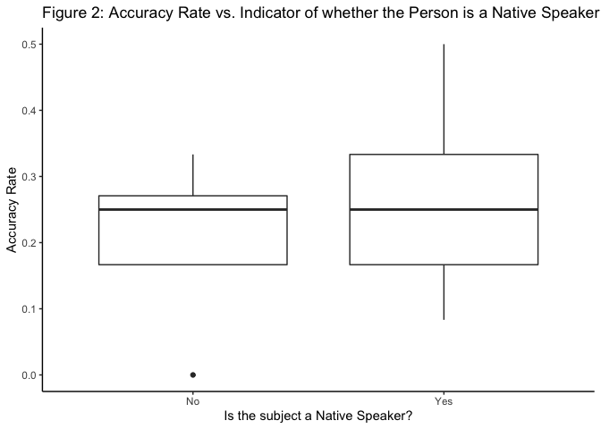
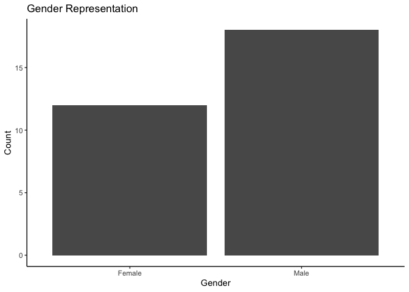
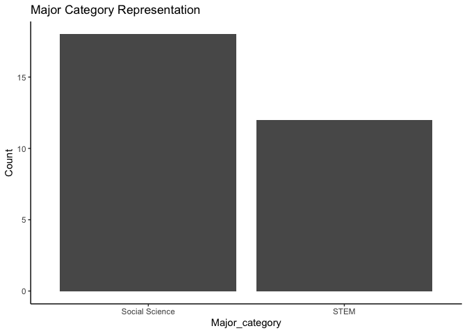

Negative Incentive Framing Structures in Cognitively Demanding Tasks
================
Tshering Wangchuk and Franco Salinas Meza

<!-- --><!-- --><!-- --><!-- --><!-- --><!-- --><!-- --><!-- --><!-- --><!-- --><!-- --><!-- --><!-- --><!-- --><!-- --><!-- --><!-- --><!-- -->

    ##                           accuracy_rate Number_of_Classes Hours_of_Sleep
    ## accuracy_rate                1.00000000         0.2877341    -0.01939005
    ## Number_of_Classes            0.28773410         1.0000000     0.21735708
    ## Hours_of_Sleep              -0.01939005         0.2173571     1.00000000
    ## share_questions_responded    0.38238526         0.2757588     0.08605471
    ##                           share_questions_responded
    ## accuracy_rate                            0.38238526
    ## Number_of_Classes                        0.27575876
    ## Hours_of_Sleep                           0.08605471
    ## share_questions_responded                1.00000000

## Understanding Factors that affect accuracy

    ## 
    ## Call:
    ## lm(formula = accuracy_rate ~ Incentive_Structure * Gender + Gender + 
    ##     school_status + English_Native + Number_of_Classes + Hours_of_Sleep + 
    ##     Workload + Major_category + share_questions_responded, data = NEW_MAJOR_CATEGORY)
    ## 
    ## Residuals:
    ##       Min        1Q    Median        3Q       Max 
    ## -0.149944 -0.052693  0.001016  0.056775  0.133537 
    ## 
    ## Coefficients:
    ##                                         Estimate Std. Error t value Pr(>|t|)  
    ## (Intercept)                             0.013241   0.144528   0.092   0.9280  
    ## Incentive_StructurePositive            -0.056490   0.069151  -0.817   0.4247  
    ## GenderMale                             -0.014204   0.060958  -0.233   0.8184  
    ## school_statusUpperclassmen             -0.060612   0.051953  -1.167   0.2586  
    ## English_NativeYes                      -0.004152   0.054057  -0.077   0.9396  
    ## Number_of_Classes                       0.002122   0.025733   0.082   0.9352  
    ## Hours_of_Sleep                          0.012899   0.016354   0.789   0.4405  
    ## WorkloadSmall                          -0.112585   0.063057  -1.785   0.0910 .
    ## Major_categorySTEM                      0.022159   0.050131   0.442   0.6637  
    ## share_questions_responded               0.299168   0.138754   2.156   0.0449 *
    ## Incentive_StructurePositive:GenderMale  0.021158   0.083363   0.254   0.8025  
    ## ---
    ## Signif. codes:  0 '***' 0.001 '**' 0.01 '*' 0.05 '.' 0.1 ' ' 1
    ## 
    ## Residual standard error: 0.09972 on 18 degrees of freedom
    ## Multiple R-squared:  0.3863, Adjusted R-squared:  0.04538 
    ## F-statistic: 1.133 on 10 and 18 DF,  p-value: 0.3917

              ────────────────────────────────────────────────────
                                                          (1)     
                                                     ─────────────
                (Intercept)                              0.013    
                                                        (0.145)   
                Incentive_StructurePositive             -0.056    
                                                        (0.069)   
                GenderMale                              -0.014    
                                                        (0.061)   
                school_statusUpperclassmen              -0.061    
                                                        (0.052)   
                English_NativeYes                       -0.004    
                                                        (0.054)   
                Number_of_Classes                        0.002    
                                                        (0.026)   
                Hours_of_Sleep                           0.013    
                                                        (0.016)   
                WorkloadSmall                           -0.113    
                                                        (0.063)   
                Major_categorySTEM                       0.022    
                                                        (0.050)   
                share_questions_responded                0.299 *  
                                                        (0.139)   
                Incentive_StructurePositive:GenderMa     0.021    
                le                                                
                                                        (0.083)   
                                                     ─────────────
                N                                       29        
                R2                                       0.386    
                logLik                                  32.623    
                AIC                                    -41.245    
              ────────────────────────────────────────────────────
                *** p < 0.001; ** p < 0.01; * p < 0.05.           

Column names: names, model1

### Incentive Structure

<!-- -->

### School Year Status

<!-- -->

### English as a Native Language

<!-- -->

## Understanding Factors that affect the share of questions responded:

    ## 
    ## Call:
    ## lm(formula = share_questions_responded ~ Incentive_Structure + 
    ##     Gender + factor(school_status) + English_Native + Number_of_Classes + 
    ##     Hours_of_Sleep + Workload + Major_category + share_questions_responded, 
    ##     data = NEW_MAJOR_CATEGORY)
    ## 
    ## Residuals:
    ##       Min        1Q    Median        3Q       Max 
    ## -0.307602 -0.068551 -0.000812  0.104916  0.272613 
    ## 
    ## Coefficients:
    ##                                    Estimate Std. Error t value Pr(>|t|)    
    ## (Intercept)                         0.71690    0.15841   4.526 0.000206 ***
    ## Incentive_StructurePositive        -0.10923    0.06791  -1.608 0.123422    
    ## GenderMale                          0.02618    0.07010   0.373 0.712736    
    ## factor(school_status)Upperclassmen  0.14645    0.07440   1.968 0.063055 .  
    ## English_NativeYes                   0.07091    0.08565   0.828 0.417485    
    ## Number_of_Classes                   0.05679    0.03932   1.444 0.164182    
    ## Hours_of_Sleep                     -0.03336    0.02516  -1.326 0.199713    
    ## WorkloadSmall                       0.32441    0.06939   4.675 0.000146 ***
    ## Major_categorySTEM                 -0.05405    0.07961  -0.679 0.504989    
    ## ---
    ## Signif. codes:  0 '***' 0.001 '**' 0.01 '*' 0.05 '.' 0.1 ' ' 1
    ## 
    ## Residual standard error: 0.1607 on 20 degrees of freedom
    ## Multiple R-squared:  0.6475, Adjusted R-squared:  0.5065 
    ## F-statistic: 4.593 on 8 and 20 DF,  p-value: 0.002672

              ────────────────────────────────────────────────────
                                                         (1)      
                                                   ───────────────
                (Intercept)                            0.717 ***  
                                                      (0.158)     
                Incentive_StructurePositive           -0.109      
                                                      (0.068)     
                GenderMale                             0.026      
                                                      (0.070)     
                factor(school_status)Upperclassmen     0.146      
                                                      (0.074)     
                English_NativeYes                      0.071      
                                                      (0.086)     
                Number_of_Classes                      0.057      
                                                      (0.039)     
                Hours_of_Sleep                        -0.033      
                                                      (0.025)     
                WorkloadSmall                          0.324 ***  
                                                      (0.069)     
                Major_categorySTEM                    -0.054      
                                                      (0.080)     
                                                   ───────────────
                N                                     29          
                R2                                     0.648      
                logLik                                17.255      
                AIC                                  -14.510      
              ────────────────────────────────────────────────────
                *** p < 0.001; ** p < 0.01; * p < 0.05.           

Column names: names, model1

<!-- -->

<!-- -->

<!-- -->

<!-- -->
